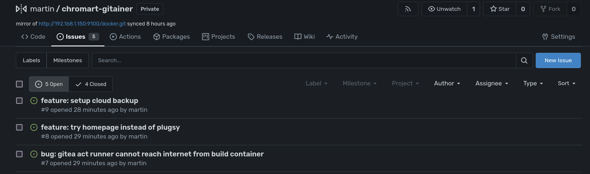
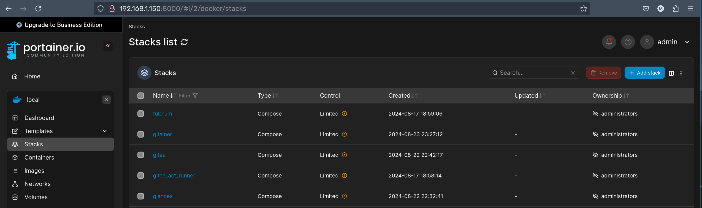

# Gitainer

Simple Git-based container management platform for Docker Standalone

## Features

- All the benefits of Git such as versioning, portability, etc.
- Pass through Variables and YAML fragments to keep your stacks DRY
- Lightweight HTTP API to trigger stack actions from CI/CD pipelines
- POST webhook option for update responses

## Usage

### Quick Start

Deploy the stack with docker compose
```
services:
  gitainer:
    image: gitea.chromart.cc/martin/gitainer
    volumes:
      - ./resources/bare:/var/gitainer/repo      
      - ./resources/data:/var/gitainer/data
      - /var/run/docker.sock:/var/run/docker.sock
    ports:
      - 3000:3000 # git server
      - 8080:8080 # webui and webhooks
    environment:
      # STACK_UPDATE_ON_ENV_CHANGE: 1
      # POST_WEBHOOK: <some POST endpoint>
      # defaults
      # GIT_ROOT: /var/gitainer/repo
      # GITAINER_DATA: /var/gitainer/data
      # REPO_NAME: docker
      # GIT_BRANCH: main
      # FRAGMENTS_PATH=fragments
```

On the machine you want to manage stacks from clone the repo
```
git clone <hostmachine>:3000/docker.git
cd docker
```

Create your stack
```
mkdir -p stacks/mystack
vi stacks/mystack/docker-compose.yaml
```

Push the changes
```
git add .
git commit -m "my first stack"
git push
```

"mystack" will now be deployed on the host machine

### Variables

Docker compose natively supports [variable interpolation](https://docs.docker.com/compose/environment-variables/variable-interpolation/) meaning that any variable in your environment will be visible to Gitainer. 

This is exceedingly useful for common repetitive fields such as your external domain or a root directory for bind mount volumes.

An example of how this can be used:

gitainer docker-compose.yaml define a variable
```
...
  environment:
    APP_DIR: /mnt/HDD/dockerStorage
```

from a compose file in Gitainer

```
...
  volumes:
    - $APP_DIR/mystack:/data
```

When actually deploying this compose file, it will be resolved as

```
  volumes:
    - /mnt/HDD/dockerStorage:/data
```

On startup, Gitainer checks the current set of environment variables against the last set of variables. If there is any differences, Gitainer will look through all stacks to see if any reference this variable and redeploy this stack if it does consume this variable.

### Infisical (secrets)
In addition to using environment variables, Gitainer also now supports Infisical for secrets and variables. Secrets will be pulled and merged into the set of environment varibles to be used as descibed above, on the following cadence:

- Gitainer service startup
- Git push
- and every 60s interval

Anytime variable changes are detected, any consuming services will be redeployed with the new value.

To set this up, provide the following environment variables in your Gitainer deployment

```
  environment: 
    INFISICAL_URL: <your infisical url>
    INFISICAL_CLIENT_ID=<your infisical machine client id>
    INFISICAL_CLIENT_SECRET=<your infisical machine client secret>

    INFISICAL_PROJECT_ID=<infisical project id>
    INFISICAL_PROJECT_ENVIRONMENT=<infisical project environment>
```

## Fragments

Docker compose also natively supports [fragments](https://docs.docker.com/reference/compose-file/fragments/). The limitation with fragments in regular Docker Compose is they require the anchor to be resolved within the same file, because [YAML documents are independant](https://github.com/docker/compose/issues/5621#issuecomment-499021562). Ultimately this means that they cannot be reused across multiple files when using built in options such as [merge](https://docs.docker.com/reference/compose-file/merge/) or [include](https://docs.docker.com/reference/compose-file/include/).

Docker compose also allows for [YAML merge syntax](https://yaml.org/type/merge.html) to add properties to existing mappings

Gitainer solves this by introducing a new concept of importing within Docker Compose. In short, adding a special comment allows you to patch in your desired fragment, before docker-compose is ever called. This allows us to get around these limitations, without any actual copy and pasting required.

### Constants Example

Let say in this example I want every service to have some common properties for restarting and grace period. I can define a fragment like this in the repo with an anchor called `common`

fragments/commonProperties.yaml
```
x-common-stuff: &common
  restart: unless-stopped
  stop_grace_period: 10m
```

then in my stack I will import it before my services and then reference the anchor `common` and merge the properties in.

```
#! fragments/commonProperties.yaml
services:
  hello:
    image: nginx
    <<: [*common]
```

Gitainer will patch in the file before it runs `docker-compose` resulting in this docker-compose.yaml

```
# fragments start

# fragments/commonProperties.yaml
x-common-stuff: &common
  restart: unless-stopped
  stop_grace_period: 10m

# fragments end

services:
  hello:
    image: nginx
    <<: [*common]
```

### Example with anchor using other anchor

Let say in this example I want a fragment that sets some container labels based on some value specific to this stack. This fragment defines an anchor `specific_labels` and expects that two anchors are defined `container_name` and `url`.

fragments/specificLabel.yaml
```
x-specific-labels: &specific_labels
  dashboardlabel.name: *container_name
  dashboardlabel.url: *url
```

then in my stack I will import it before my services and but after `container_name` and `url` anchors have been defined

```
x-configuration:
  x-name: &container_name myname
  x-url: &url https://myname.mydomain.com

#! fragments/specificLabel.yaml
services:
  hello:
    image: nginx
    labels:
      <<: [*specific_labels]
```

Gitainer will patch in the file before it runs `docker-compose` resulting in this docker-compose.yaml

```
x-configuration:
  x-name: &container_name myname
  x-url: &url https://myname.mydomain.com

# fragments start

# fragments/specificLabel.yaml
x-specific-labels: &specific_labels
  dashboardlabel.name: *container_name
  dashboardlabel.url: *url

# fragments end

services:
  hello:
    image: nginx
    labels:
      <<: [*specific_labels]
```

## Motivation

Since getting in to selfhosting about 2 years ago, I have used Portainer to manage Docker stacks. After using it for a while, I found many areas in which I thought the core experience of managing stacks could be improved.

Most people already use git repos to manage their stacks, or some structured directories on the host machine where they manually run `docker-compose` for when making changes. For myself, I used a git repo on my local Gitea instance, which contained a custom action script that could gather the diff of my changes and then make POST requests to the Portainer API.

This was a clunky solution for many reasons and I ultimately came to the conclusion that building something simple to automate this process would be more valuable and extensible for the future and may also help others that are looking for this sort of solution.

## example integrations

Gitainer does not provide a UI for access, but does play well with other existing tools for this.

Keep your compose files managed Gitainer for editing / deployments and handle operations with other tooling.

This is not an exhaustive list but just a shortlist of things that I am experimenting with to improve my own homelab.

### [Dockwatch](https://github.com/Notifiarr/dockwatch)
You can use dockwatch to monitor containers managed by Gitainer and even automatically schedule checking for updates. 
This is a super powerful combination with Gitainer for infrastructure as code and Dockwatch for managing homelab operations.

### [VSCode Web (web interface to a git repo)](https://hub.docker.com/r/linuxserver/code-server)

Concerned about not being able to edit stacks away from your desktop? Fear not, you can use something like VSCode web to have an on the go solution. 

This also has the benefit of being able to install extensions directly into the web interface for YAML editing (like my [dotenv autocomplete fork with YAML support](https://github.com/martindmtrv/dotenv-vscode-stripped/tree/yaml))

### [Gitea (mirror repository)](https://docs.gitea.com/usage/repo-mirror#pulling-from-a-remote-repository)

You can mirror your Gitainer repo to Gitea to have an interface to view the repo status and commit history from anywhere. 

Most importantly, you can have issue tracking for your stacks, right with the repo making it easy to track any bugs or features you want to add to your homelab



### [Portainer (minus stack creation)](https://docs.portainer.io/start/install-ce/server/docker/linux)

I know one of the reasons I built this project is to avoid using Portainer to manage my Docker stacks, but it is actually a pretty powerful tool for monitoring.

If you have gotten used to using Portainer for managing containers and viewing logs, you can still do so! Use Gitainer to version your compose files and use portainer for any container management, so you get the best of both worlds

All of your stacks will be visible with "limited" access because they are created outside of Portainer, but containers can still be accessed directly and stopped, restarted, recreated and updated.



## migration from portainer

Go into Portainer webui and download a backup file:

portainer > settings > download backup file

Create a temp directory on the host machine and put the portainer-backup*.tar.gz file in it

```
mkdir -p /tmp/migration
cp portainer-backup*.tar.gz /tmp/migration/
```

Run Docker command with a one off container, with the /var/gitainer/migration directory mounted as the directory we just created.

```
docker run --rm -it -v /tmp/migration:/var/gitainer/migration gitea.chromart.cc/martin/gitainer migrate-portainer
```

Now copy the contents of the output folder to your Gitainer repo:

```
cp -r /tmp/migration/* <my-gitainer-repo>/
```


Verify the changes, then commit and push

```
git add .
git commit -m "migrating from portainer"
git push
```
