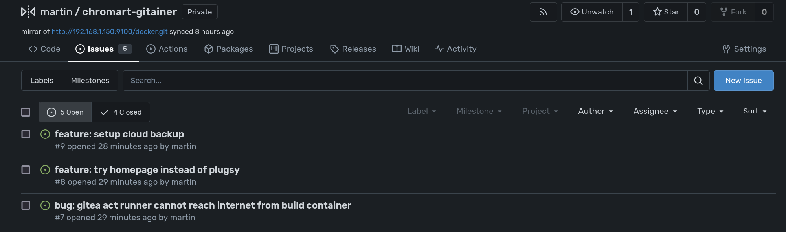
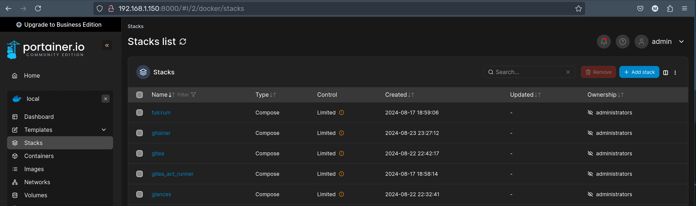

# Gitainer

Simple Git-based container management platform for Docker Standalone

## Features

- All the benefits of Git such as versioning, portability, etc.
- Pass through Variables and YAML fragments to keep your stacks DRY
- Prepend setup commands to containers via `prefix_entrypoint` without overriding original execution
- Lightweight HTTP API to trigger stack actions from CI/CD pipelines
- POST webhook option for update responses

## Usage

### Quick Start

Deploy the stack with docker compose
```
services:
  gitainer:
    image: ghcr.io/martindmtrv/gitainer
    volumes:
      - ./resources/bare:/var/gitainer/repo      
      - ./resources/data:/var/gitainer/data
      - /var/run/docker.sock:/var/run/docker.sock
    ports:
      - 3000:3000 # git server
      - 8080:8080 # webui and webhooks
    environment:
      # GITAINER_API_KEY: <optional API key to secure webhooks>
      # STACK_UPDATE_ON_ENV_CHANGE: 1
      # POST_WEBHOOK: <some POST endpoint>
      # GITAINER_SELF_STACK: <name of the stack that is gitainer's own deployment, see Self-Updating Gitainer>
      # GITAINER_SELF_UPDATE_HELPER_IMAGE: docker:27.1.2-alpine3.20
      # defaults
      # GIT_ROOT: /var/gitainer/repo
      # GITAINER_DATA: /var/gitainer/data
      # REPO_NAME: docker
      # GIT_BRANCH: main
      # FRAGMENTS_PATH=fragments
```

On the machine you want to manage stacks from clone the repo
```
git clone <hostmachine>:3000/docker.git
cd docker
```

Create your stack
```
mkdir -p stacks/mystack
vi stacks/mystack/docker-compose.yaml
```

Push the changes
```
git add .
git commit -m "my first stack"
git push
```

"mystack" will now be deployed on the host machine

### POST Webhook

If `POST_WEBHOOK` is set, Gitainer will send an HTTP POST with a `Content-Type: application/json` header to that URL after a stack update completes. The body is the plain JSON result object itself (not a string-wrapped copy) — parse it directly as JSON.

Every payload includes a `title` field so you can tell which of the three triggers fired it: `"Gitainer: Git Push"`, `"Gitainer: Env Update"`, or `"Gitainer: Webhook"`. The `msg`/`err` field is a self-contained status string that names the affected stack(s), so you don't need to also inspect `changes`/`stackName`/`output` just to know what happened — handy if you're feeding this straight into a notifier.

There are two triggers for this webhook, each with a slightly different payload shape:

**Push-triggered synthesis** (a `git push` deploying one or more stacks — `title: "Gitainer: Git Push"` — or a resynthesis triggered by `STACK_UPDATE_ON_ENV_CHANGE` — `title: "Gitainer: Env Update"`) fires the webhook on both success and failure:
```json
{
  "title": "Gitainer: Git Push",
  "msg": "Synthesis succeeded for 1 stack(s): stacks/mystack/docker-compose.yaml",
  "changes": [
    { "file": "stacks/mystack/docker-compose.yaml", "type": "M", "reason": "..." }
  ]
}
```

On failure from a `git push` (where the bad commit is rolled back), the payload also reports what was rolled back:
```json
{
  "title": "Gitainer: Git Push",
  "err": "Got an error during synthesis of stack \"stacks/mystack/docker-compose.yaml\", removing the bad commit. Succeeded stacks (not rolled back): stacks/other/docker-compose.yaml. Error: ...",
  "output": "...",
  "failedStackContent": "...",
  "suceededStacks": ["stacks/other/docker-compose.yaml"],
  "failedStack": "stacks/mystack/docker-compose.yaml",
  "latestCommit": {
    "hash": "abc1234...",
    "date": "2026-07-18 07:30:00 +0000",
    "message": "my first stack",
    "refs": "HEAD -> main",
    "body": "",
    "author_name": "...",
    "author_email": "..."
  }
}
```

On failure from an env-change-triggered resynthesis (no commit to roll back), the payload is just:
```json
{
  "title": "Gitainer: Env Update",
  "err": "Got an error during synthesis of stack \"stacks/mystack/docker-compose.yaml\": ...",
  "output": "...",
  "failedStackContent": "..."
}
```

**API-triggered update** (`POST /api/stacks/:stackName`, `title: "Gitainer: Webhook"`) only fires the webhook on success — a failed update responds to the caller with a 400 and `{ "err": "..." }`, but does not notify `POST_WEBHOOK`:
```json
{
  "title": "Gitainer: Webhook",
  "stackName": "mystack",
  "msg": "Successfully updated stack mystack: ...",
  "output": "..."
}
```

**Bulk stop/start by label** (`POST /api/labels/:identifier/stop`, `POST /api/labels/:identifier/start`, `title: "Gitainer: Webhook"`) stops or starts every container labelled `gitainer.identifier=<identifier>`, regardless of which stack it belongs to. Only fires the webhook on success — a docker error responds to the caller with a 400 and `{ "err": "..." }`, but does not notify `POST_WEBHOOK`:
```json
{
  "title": "Gitainer: Webhook",
  "identifier": "myapp",
  "msg": "Stopped 2 container(s) labelled gitainer.identifier=myapp",
  "containerIds": ["abc123...", "def456..."]
}
```

To make containers eligible, label them in the compose file:
```yaml
services:
  app:
    labels:
      gitainer.identifier: myapp
```

**Registry cleanup** (`POST /api/registry/:containerName/cleanup`, `title: "Gitainer: Webhook"`) runs `registry garbage-collect` inside a running Docker Registry ([distribution/distribution](https://hub.docker.com/_/registry)) container via `docker exec`, reclaiming blob storage from deleted/untagged manifests. Only fires the webhook on success — a docker error responds to the caller with a 400 and `{ "err": "..." }`, but does not notify `POST_WEBHOOK`:
```json
{
  "title": "Gitainer: Webhook",
  "containerName": "registry",
  "msg": "Ran registry garbage-collect on registry",
  "output": "..."
}
```
Query params: `?deleteUntagged=true` adds registry's `-m` flag (also delete manifests with no tags); `?configPath=...` overrides the config file path inside the container (default `/etc/docker/registry/config.yml`).

**Named commands** (`POST /api/commands/:name`, `title: "Gitainer: Webhook"`) run an operator-defined `docker exec ...` command via `GITAINER_COMMANDS`, a JSON object mapping a name to a command string. Only `docker exec` commands are accepted (not arbitrary shell) - Gitainer validates every command at startup and refuses to start if one doesn't start with `docker exec`. Unknown name returns a 404. Only fires the webhook on success - a docker error responds to the caller with a 400 and `{ "err": "..." }`, but does not notify `POST_WEBHOOK`:
```json
{
  "title": "Gitainer: Webhook",
  "name": "registry-gc",
  "msg": "Ran command \"registry-gc\"",
  "output": "..."
}
```
```
GITAINER_COMMANDS={"registry-gc":"docker exec registry registry garbage-collect /etc/docker/registry/config.yml"}
```
The built-in `/api/registry/:containerName/cleanup` endpoint above covers the common registry-cleanup case with a typed response; `GITAINER_COMMANDS` is the escape hatch for anything else you want exposed as an API call.

#### Example: forwarding to Apprise

[Apprise API](https://github.com/caronc/apprise-api) is a self-hosted REST front-end for [Apprise](https://github.com/caronc/apprise) that fans a single webhook out to Discord, Telegram, ntfy, Slack, and dozens of other notification services. Point `POST_WEBHOOK` at its `/notify/<tag>` endpoint and remap Gitainer's `msg`/`err` fields onto Apprise's `body` field:

```
POST_WEBHOOK=https://apprise.example.com/notify/gitainer?:msg=body&:err=body
```

`title` doesn't need remapping — Apprise API already reads a top-level `title` key by default, and Gitainer's payload already has one, so `Gitainer: Git Push` / `Gitainer: Env Update` / `Gitainer: Webhook` shows up as the notification title automatically.

In docker-compose, quote the value since it contains `?`, `&`, and `:`:
```yaml
environment:
  POST_WEBHOOK: "https://apprise.example.com/notify/gitainer?:msg=body&:err=body"
```

### Variables

Docker compose natively supports [variable interpolation](https://docs.docker.com/compose/environment-variables/variable-interpolation/) meaning that any variable in your environment will be visible to Gitainer. 

This is exceedingly useful for common repetitive fields such as your external domain or a root directory for bind mount volumes.

An example of how this can be used:

gitainer docker-compose.yaml define a variable
```
...
  environment:
    APP_DIR: /mnt/HDD/dockerStorage
```

from a compose file in Gitainer

```
...
  volumes:
    - $APP_DIR/mystack:/data
```

When actually deploying this compose file, it will be resolved as

```
  volumes:
    - /mnt/HDD/dockerStorage:/data
```

On startup, Gitainer checks the current set of environment variables against the last set of variables. If there is any differences, Gitainer will look through all stacks to see if any reference this variable and redeploy this stack if it does consume this variable.

### Infisical (secrets)
In addition to using environment variables, Gitainer also now supports Infisical for secrets and variables. Secrets will be pulled and merged into the set of environment varibles to be used as descibed above, on the following cadence:

- Gitainer service startup
- Git push
- and every 60s interval

Anytime variable changes are detected, any consuming services will be redeployed with the new value.

To set this up, provide the following environment variables in your Gitainer deployment

```
  environment: 
    INFISICAL_URL: <your infisical url>
    INFISICAL_CLIENT_ID=<your infisical machine client id>
    INFISICAL_CLIENT_SECRET=<your infisical machine client secret>

    INFISICAL_PROJECT_ID=<infisical project id>
    INFISICAL_PROJECT_ENVIRONMENT=<infisical project environment>
```

### Remote Docker Host

Gitainer allows deploying a specific stack to a remote Docker host. To configure this, add a special comment prefix `#@` exactly at the very first line of your stack's `docker-compose.yaml`:

```yaml
#@ root@192.168.1.100:/opt/stack
services:
  app:
    image: alpine
    ...
```

The syntax for the remote host is:
```yaml
#@ [scheme://]user@host[:port][:path]
```
- **DOCKER_HOST**: If the scheme is omitted, it defaults to `ssh://` (e.g. `ssh://root@192.168.1.100`). Other schemes like `tcp://` are also supported.
- **COMPOSE_PROJECT_DIR**: If a path suffix is provided at the end (separated by a colon, e.g. `:/opt/stack` or `:opt/stack`), it will set the `COMPOSE_PROJECT_DIR` environment variable for the deployment (optional).

> [!WARNING]
> This directive is strictly validated and is **only allowed once per stack, exactly at the first line**. Pushing it elsewhere in the file will reject the push and return a validation error.

#### Exposing SSH Keys to Gitainer
Since Gitainer runs inside a Docker container, you must expose your host's SSH credentials to the container for remote SSH deployments:

##### Option A: Mount host's SSH directory (Simple)
Mount your local `.ssh` directory into the container's home directory (read-only) in your Gitainer deployment:
```yaml
    volumes:
      - /var/run/docker.sock:/var/run/docker.sock
      - ~/.ssh:/root/.ssh:ro
```

##### Option B: Mount the SSH Agent Socket (Recommended & Secure)
If you run `ssh-agent` on the host, mount the SSH agent socket and pass the environment variable:
```yaml
    volumes:
      - /var/run/docker.sock:/var/run/docker.sock
      - ${SSH_AUTH_SOCK}:/ssh-agent
    environment:
      - SSH_AUTH_SOCK=/ssh-agent
```

### Self-Updating Gitainer

Gitainer can manage its own deployment as a normal stack, so pushing a change to it (e.g. bumping the image tag) pulls the new image and redeploys itself. This isn't automatic like other stacks: normally a stack update runs `down` before `pull`/`up`, but if the stack being updated is gitainer's own container, that `down` would kill the very process performing the update. To make this safe, set `GITAINER_SELF_STACK` to the name of the stack that is gitainer's own deployment (e.g. `gitainer` if it lives at `stacks/gitainer/docker-compose.yaml`):

```yaml
environment:
  GITAINER_SELF_STACK: gitainer
  # GITAINER_SELF_UPDATE_HELPER_IMAGE: docker:27.1.2-alpine3.20 (default, override for air-gapped/mirrored registries)
```

With `GITAINER_SELF_STACK` set, a push that touches that stack pulls the new image in-process (safe - it never touches the running container), then hands the actual recreate off to a short-lived, detached helper container launched via the Docker socket. That helper survives gitainer's own container being replaced, since it's a sibling container rather than a child process.

A few things to know:
- **Fire-and-forget, no auto-rollback.** Once the helper container is launched, gitainer can't observe or roll back the outcome the way it does for other stacks - a broken self-update must be fixed forward with another push, not reverted automatically.
- **Deletes are protected.** Pushing a deletion of the self-stack is refused (the running container is left untouched) rather than silently tearing down the only thing that could push a fix. The refusal is reported as a `warnings` entry on the synthesis result / `POST_WEBHOOK` payload.
- **No remote hosts.** A `#@` remote-host comment on the self-stack is rejected - gitainer can only self-update the host it's actually running on.
- **Misconfiguration risk.** If `GITAINER_SELF_STACK` doesn't match gitainer's actual compose project, self-update protection silently doesn't apply and the original down-yourself problem can reoccur. Gitainer logs a startup warning on a mismatch it can detect, but double-check the name matches your deployment.

#### Migrating an existing deployment into a self-stack

If you're already running gitainer (or any compose deployment) via `docker compose up -d` outside of gitainer's management, you can bring it under self-update with no downtime as long as the compose project name stays the same before and after:

1. Find the project name your current deployment is running under (it defaults to the directory name you ran `docker compose up` from, or check with `docker inspect <container> --format '{{index .Config.Labels "com.docker.compose.project"}}'`).
2. Use that exact name as your self-stack name going forward - it needs to match both `GITAINER_SELF_STACK` and the `stacks/<name>/` directory you push to, so that the sibling container's `up -d --force-recreate` recognizes your existing containers as the same project and replaces them in place instead of standing up a second, conflicting copy.
3. Add `GITAINER_SELF_STACK: <name>` to your current deployment's environment and restart it once (`docker compose up -d`) to pick it up. This is the only manual step - after this, updates flow through git pushes.
4. Clone gitainer's repo, create `stacks/<name>/docker-compose.yaml` with the same service definitions you're already running, commit, and push. Gitainer treats this first push the same as any other self-update (routed through the safe `composeSelfUpdate` path), so it force-recreates your existing containers under the matching project rather than starting fresh ones.

##### Porting an external `.env` file

If your existing deployment sources variables from a `.env` file next to its compose file (docker compose's native auto-loading), that file has no equivalent once the compose file itself moves into gitainer's git repo - the "[Variables](#variables)" mechanism above needs those variables in gitainer's own process environment, not in a file sitting next to a compose file gitainer doesn't run from.

The simplest way to carry it over is to mount the existing `.env` file straight into gitainer's container: Bun (which gitainer runs on) automatically loads a `.env` file from its working directory at startup, so mounting yours to `/home/gitainer/.env` makes every variable in it available for compose variable interpolation across all your managed stacks, exactly as if it had been set under `environment:` directly:

```yaml
services:
  gitainer:
    volumes:
      - ./path/to/existing/.env:/home/gitainer/.env:ro
      ...
```

Since it's only read once at process startup, edits to the mounted file require restarting the gitainer container to take effect - the same caveat that already applies to variables set directly under `environment:`.

This works for self-stacks too, not just other managed stacks: gitainer forwards its own environment (mounted `.env` included) into the detached sibling container that performs the self-update recreate, so `${VAR}`-style interpolation in the self-stack's own compose file resolves the same way there as it does everywhere else.

## Fragments

Docker compose also natively supports [fragments](https://docs.docker.com/reference/compose-file/fragments/). The limitation with fragments in regular Docker Compose is they require the anchor to be resolved within the same file, because [YAML documents are independant](https://github.com/docker/compose/issues/5621#issuecomment-499021562). Ultimately this means that they cannot be reused across multiple files when using built in options such as [merge](https://docs.docker.com/reference/compose-file/merge/) or [include](https://docs.docker.com/reference/compose-file/include/).

Docker compose also allows for [YAML merge syntax](https://yaml.org/type/merge.html) to add properties to existing mappings

Gitainer solves this by introducing a new concept of importing within Docker Compose. In short, adding a special comment allows you to patch in your desired fragment, before docker-compose is ever called. This allows us to get around these limitations, without any actual copy and pasting required.

### Constants Example

Let say in this example I want every service to have some common properties for restarting and grace period. I can define a fragment like this in the repo with an anchor called `common`

fragments/commonProperties.yaml
```
x-common-stuff: &common
  restart: unless-stopped
  stop_grace_period: 10m
```

then in my stack I will import it before my services and then reference the anchor `common` and merge the properties in.

```
#! fragments/commonProperties.yaml
services:
  hello:
    image: nginx
    <<: [*common]
```

Gitainer will patch in the file before it runs `docker-compose` resulting in this docker-compose.yaml

```
# fragments start

# fragments/commonProperties.yaml
x-common-stuff: &common
  restart: unless-stopped
  stop_grace_period: 10m

# fragments end

services:
  hello:
    image: nginx
    <<: [*common]
```

### Example with anchor using other anchor

Let say in this example I want a fragment that sets some container labels based on some value specific to this stack. This fragment defines an anchor `specific_labels` and expects that two anchors are defined `container_name` and `url`.

fragments/specificLabel.yaml
```
x-specific-labels: &specific_labels
  dashboardlabel.name: *container_name
  dashboardlabel.url: *url
```

then in my stack I will import it before my services and but after `container_name` and `url` anchors have been defined

```
x-configuration:
  x-name: &container_name myname
  x-url: &url https://myname.mydomain.com

#! fragments/specificLabel.yaml
services:
  hello:
    image: nginx
    labels:
      <<: [*specific_labels]
```

Gitainer will patch in the file before it runs `docker-compose` resulting in this docker-compose.yaml

```
x-configuration:
  x-name: &container_name myname
  x-url: &url https://myname.mydomain.com

# fragments start

# fragments/specificLabel.yaml
x-specific-labels: &specific_labels
  dashboardlabel.name: *container_name
  dashboardlabel.url: *url

# fragments end

services:
  hello:
    image: nginx
    labels:
      <<: [*specific_labels]
```

### Fragment Aliases

Often you'll want to reuse the same fragment multiple times in a single compose file. This is normally impossible since duplicate anchors would collide. 
Gitainer solves this by introducing **Fragment Aliases**. When you provide the `as <alias>` syntax, Gitainer suffixes all defined and referenced anchors (`&anchor` and `*anchor`) inside the fragment with `-<alias>`.

fragments/db.yaml
```yaml
x-database: &postgres
  image: postgres:15
  restart: unless-stopped
  environment:
    POSTGRES_PASSWORD: *db_password
```

In your stack `docker-compose.yaml`:
```yaml
x-secrets:
  x-primary-pw: &db_password-primary "securepass1"
  x-replica-pw: &db_password-replica "securepass2"

#! fragments/db.yaml as primary
#! fragments/db.yaml as replica

services:
  app-db:
    <<: *postgres-primary
    container_name: primary-db
  
  replica-db:
    <<: *postgres-replica
    container_name: replica-db
```

### Prefix Entrypoint

Gitainer provides a custom property `prefix_entrypoint` to easily prepend setup commands (like symlinking, pulling dependencies, or calling webhooks) before your container's original `ENTRYPOINT` and `CMD` execute, without losing the image's downstream default execution sequence.

This is highly useful because standard Docker Compose requires you to duplicate and hardcode the image's original entrypoint and command if you override the entrypoint to run a custom script. With `prefix_entrypoint`, you can leave the command and entrypoint unspecified, and Gitainer will resolve them dynamically.

#### Example:
In your stack's `docker-compose.yaml`:
```yaml
services:
  web:
    image: nginx:alpine
    prefix_entrypoint:
      - curl -X POST https://api.webhooks.com/container-started
```

Under the hood, Gitainer automatically pulls the image, inspects its embedded metadata (Entrypoint and Cmd), and generates a `/bin/sh -c` wrapper script using `exec "$@"` to pass the image's native execution arguments safely.

## Motivation

Since getting in to selfhosting about 2 years ago, I have used Portainer to manage Docker stacks. After using it for a while, I found many areas in which I thought the core experience of managing stacks could be improved.

Most people already use git repos to manage their stacks, or some structured directories on the host machine where they manually run `docker-compose` for when making changes. For myself, I used a git repo on my local Gitea instance, which contained a custom action script that could gather the diff of my changes and then make POST requests to the Portainer API.

This was a clunky solution for many reasons and I ultimately came to the conclusion that building something simple to automate this process would be more valuable and extensible for the future and may also help others that are looking for this sort of solution.

## example integrations

Gitainer does not provide a UI for access, but does play well with other existing tools for this.

Keep your compose files managed Gitainer for editing / deployments and handle operations with other tooling.

This is not an exhaustive list but just a shortlist of things that I am experimenting with to improve my own homelab.

### [Dockwatch](https://github.com/Notifiarr/dockwatch)
You can use dockwatch to monitor containers managed by Gitainer and even automatically schedule checking for updates. 
This is a super powerful combination with Gitainer for infrastructure as code and Dockwatch for managing homelab operations.

### [VSCode Web (web interface to a git repo)](https://hub.docker.com/r/linuxserver/code-server)

Concerned about not being able to edit stacks away from your desktop? Fear not, you can use something like VSCode web to have an on the go solution. 

This also has the benefit of being able to install extensions directly into the web interface for YAML editing (like my [dotenv autocomplete fork with YAML support](https://github.com/martindmtrv/dotenv-vscode-stripped/tree/yaml))

### [Gitea (mirror repository)](https://docs.gitea.com/usage/repo-mirror#pulling-from-a-remote-repository)

You can mirror your Gitainer repo to Gitea to have an interface to view the repo status and commit history from anywhere. 

Most importantly, you can have issue tracking for your stacks, right with the repo making it easy to track any bugs or features you want to add to your homelab



### [Portainer (minus stack creation)](https://docs.portainer.io/start/install-ce/server/docker/linux)

I know one of the reasons I built this project is to avoid using Portainer to manage my Docker stacks, but it is actually a pretty powerful tool for monitoring.

If you have gotten used to using Portainer for managing containers and viewing logs, you can still do so! Use Gitainer to version your compose files and use portainer for any container management, so you get the best of both worlds

All of your stacks will be visible with "limited" access because they are created outside of Portainer, but containers can still be accessed directly and stopped, restarted, recreated and updated.



## migration from portainer

Go into Portainer webui and download a backup file:

portainer > settings > download backup file

Create a temp directory on the host machine and put the portainer-backup*.tar.gz file in it

```
mkdir -p /tmp/migration
cp portainer-backup*.tar.gz /tmp/migration/
```

Run Docker command with a one off container, with the /var/gitainer/migration directory mounted as the directory we just created.

```
docker run --rm -it -v /tmp/migration:/var/gitainer/migration ghcr.io/martindmtrv/gitainer migrate-portainer
```

Now copy the contents of the output folder to your Gitainer repo:

```
cp -r /tmp/migration/* <my-gitainer-repo>/
```


Verify the changes, then commit and push

```
git add .
git commit -m "migrating from portainer"
git push
```
